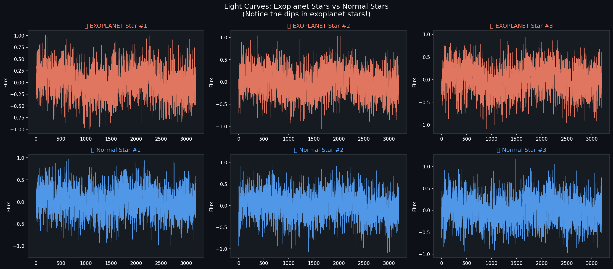

# Exoplanet Detection from Kepler Light Curves 🔭

Detecting exoplanets from NASA Kepler light curves using classical ML and Deep Learning.


## Overview

This project analyzes flux (light intensity) data from stars observed by the NASA Kepler
space telescope to classify each star as **exoplanet-hosting** or **non-exoplanet-hosting**.
A transiting exoplanet causes a small, periodic dip in a star's brightness as it passes in
front of it — this project trains models to detect that pattern automatically.

## Dataset

- **Source:** [<DATASET NAME, e.g. Kaggle "Kepler Labelled Time Series Data">](<DATASET LINK>)
- **Size:** `<N>` stars total, `<N_POS>` labeled exoplanet-hosting (highly imbalanced dataset)
- **Features:** Flux (brightness) values recorded over `<N_TIMESTEPS>` time steps per star
- Raw data is not included in this repo. Download instructions: `<ADD DOWNLOAD SCRIPT OR STEPS>`

## Approach

1. **Preprocessing** — normalization, noise reduction, handling missing values
2. **Feature engineering** — FFT (Fast Fourier Transform) analysis to extract frequency-domain features from light curves
3. **Class imbalance handling** — SMOTE applied **only on the training split** to avoid data leakage
4. **Models trained:**
   - Random Forest
   - XGBoost
   - CNN-LSTM (deep learning, sequence-based)

## Results

> ⚠️ Because exoplanets are rare in this dataset, accuracy alone is misleading.
> Precision, recall, and F1 for the **exoplanet class specifically** are the metrics that matter here.

| Model | Precision (exoplanet) | Recall (exoplanet) | F1 (exoplanet) | ROC-AUC |
|---|---|---|---|---|
| Random Forest | `<X>` | `<X>` | `<X>` | `<X>` |
| XGBoost | `<X>` | `<X>` | `<X>` | `<X>` |
| CNN-LSTM | `<X>` | `<X>` | `<X>` | `<X>` |

**Confusion Matrix (best model)**


**Precision-Recall Curve**


**Sample Light Curves**



## Project Structure

```
├── notebooks/
│   └── Exoplanet_Detection_Kepler.ipynb   # main exploration & training notebook
├── images/                                 # result plots used in this README
├── requirements.txt
├── LICENSE
└── README.md
```

## How to Run

```bash
git clone https://github.com/Ansh-san/Exoplanet-Detection-Kepler.git
cd Exoplanet-Detection-Kepler
pip install -r requirements.txt
jupyter notebook notebooks/Exoplanet_Detection_Kepler.ipynb
```

## Limitations & Future Work

- `<e.g. Model trained only on Kepler data — generalization to TESS data untested>`
- `<e.g. Deeper CNN architectures / attention-based models could be explored>`
- `<e.g. Hyperparameter tuning was limited to X, could expand with grid/Bayesian search>`

## References

- NASA Kepler Mission: https://www.nasa.gov/mission_pages/kepler/main/index.html
- `<Add dataset citation here>`

## License

This project is licensed under the MIT License — see [LICENSE](LICENSE) for details.
